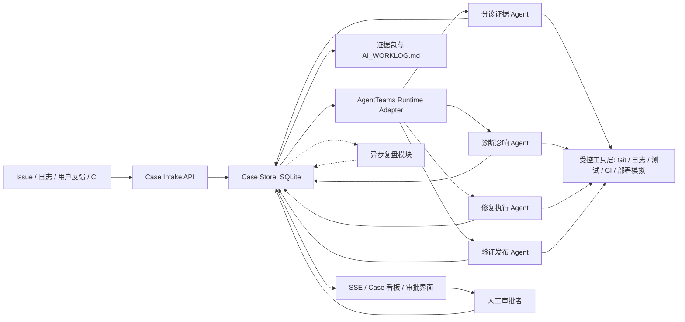
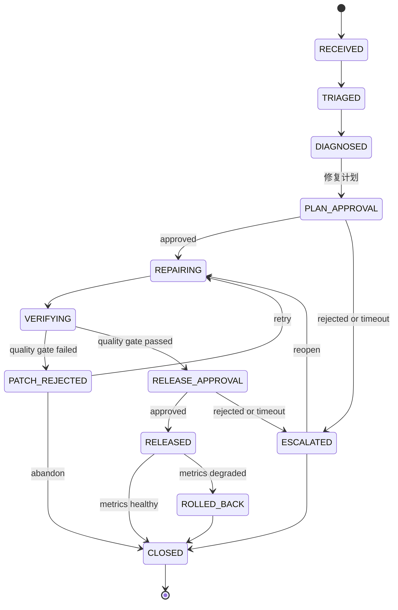

# GOAI 方向三项目框架（已审核）

> **项目暂定名：** Code CCTV DevLoop（可观测、可审计的多 Agent 软件研发闭环）  
> **版本：** v0.5 Reviewed  
> **状态：** 已审核，本文不对应任何已实施的功能改动。  
> **赛道对应：** GOAI Agent Infra - 方向三「软件研发全流程协同」

---

## 1. 一页结论

Code CCTV 已经具备本项目最难替代的基础能力：本地结构化事件采集、按工作区/会话隔离的 SQLite 事件留存、SSE 实时状态流、中文工作日志和 Windows/macOS 可视化界面。

新项目不应推倒重来，而应在现有"**研发过程可见**"的产品上增加"**受控的多 Agent 研发处置闭环**"：将 Issue、日志、测试失败和用户反馈聚合为研发事件；由 AgentTeams 编排的多个 Agent 完成诊断、修复、验证和复盘；全部中间结论、审批和结果都作为可审计证据保留。

核心定位不是自动写代码，而是：

> 将一次软件缺陷处置变成可追踪、可验证、可回滚、可复用的工程闭环。

### 1.1 竞赛要求映射

| 赛道要求 | 本项目的响应 |
| --- | --- |
| 不少于 3 个不同职能 Agent | 设计 4 个核心业务 Agent（分诊、诊断、修复、验证），编排与安全门禁由 AgentTeams Adapter + 编排层负责，复盘知识沉淀为异步批处理模块。 |
| 必须以 AgentTeams 为协同设计基点 | 引入 `AgentTeams Runtime Adapter`，将角色、任务、上下文、状态和审批门禁映射到 AgentTeams 的团队与任务能力。本地 mock 仅用于单元测试与离线开发；P2 完成条件为两条案例在真实 AgentTeams Runtime 跑通并导出 Team/Task/Trace 证据。 |
| 输入、拆解、上下文、工具、验证、证据、审批、经验沉淀 | 以"研发事件（Case）"为主线，定义状态机、交接契约、证据包和知识沉淀记录。 |
| Demo 可运行、可审计 | 使用可重复回放的故障演练样本（2 个预置案例：成功修复 + 验证失败/回滚），展示从多源输入到灰度验证/回滚判定的全链路。 |
| Skill 复用与开源价值 | 将分诊、诊断、补丁评审、验证、复盘拆为可独立复用的 Skill 与工具接口，每类提供 2-3 个具体候选条目（详见第 11 节）。 |

### 1.2 Agent 设计策略

MVP 采用 **4 个核心业务 Agent + 编排层 + 异步复盘模块** 的结构，而非将所有能力都建模为 Agent：

- **4 个核心 Agent**（Triage → Diagnosis → Repair → Verification）完成业务闭环，每个都有清晰的身份定义、工具白名单和输入输出 Schema。
- **编排与安全门禁**由 `agent_runtime/` 层的状态机和 AgentTeams Adapter 负责，不作为独立 Agent。Orchestrator 的职责（创建 Case、拆解任务、请求审批、推进状态机）属于编排基础设施，不应被建模为一个"与其他 Agent 对等的 Agent"。
- **复盘知识沉淀**（Retrospective）降级为 Case 关闭后的异步批处理模块，不参与实时协同链。这样既减少实时 Agent 间的交接复杂度，也避免复盘 Agent 在等待 Case 关闭时占用协同上下文。

### 1.3 本轮设计边界

- 首个 Demo 运行在本地沙箱和受控测试仓库中，不直接修改生产环境或自动发布生产版本。
- 现有 `POST /api/events`、`GET /api/state` 和 SSE 流保持兼容；新增研发闭环数据不破坏 Code CCTV 的监控功能。
- AgentTeams 的具体 SDK、部署方式和鉴权方案须在 P0 阶段通过 Hello World 验证确认；本设计先固定其职责边界和适配接口。本地 mock（见第 6.1 节）仅用于单元测试与离线开发，不作为赛事 Demo 的替代路径。

---

## 2. 现有项目基础与复用方式

| 现有模块 | 已有能力 | 在新项目中的作用 | 改造原则 |
| --- | --- | --- | --- |
| `daemon/server.py` | 本地 HTTP API、鉴权、SSE 广播 | 研发事件、审批和证据的本地服务入口；向界面推送 Case 状态 | 保留现有 API，新增独立 Case API。 |
| `daemon/store.py` | SQLite、会话隔离、事件保留、状态聚合 | 保存 Case、Agent 运行、证据、审批、知识记录 | 保留 `projects`/`events` 表；复用现有 `migrate_schema()` 机制新增专用表。 |
| `scripts/event_client.py` | 向 daemon 上报结构化事件 | 作为各 Agent 的统一观测事件客户端 | 扩展事件类型，不让 Agent 直接写 SQLite。 |
| `scripts/update_worklog.py` | 中文工作日志、文件/验证/决策记录 | 生成面向人的案件摘要和复盘材料 | 工作日志是可读证据的投影，不是唯一事实来源。 |
| `skills/code-cctv/SKILL.md` | AI 编程过程的可见性规范 | 形成"每一步都留下证据"的通用研发协作 Skill | 新增竞赛专用 Skill，不改变当前日常工作流。 |
| `windows/` 与 `macos/` | 多工作区、会话、事件流和管理界面 | 增加 Case 队列、审批、证据链与发布状态视图 | 先完成后端和 Web/CLI 演示，再接入原生界面。 |
| `tests/` | Python 单元测试、HTTP/SSE 覆盖 | 作为修复验证证据和演示中的质量门禁 | 所有 Agent 产生的补丁必须经过测试。 |

### 2.1 现有能力与竞赛差距

当前 Code CCTV 擅长"记录编程过程"，但尚未具备以下能力：标准化研发事件模型、自动分诊与根因分析、受控补丁执行、审批/回滚、部署验证、可查询知识库及 AgentTeams 编排。这些能力正是新框架需要补齐的部分。

---

## 3. 目标场景与 MVP

### 3.1 目标场景

面向 AI 辅助软件研发团队，将下列输入合成为一个可处置的研发事件：

- Issue/工单：开发者或测试人员提交的现象与期望。
- 运行日志/告警：错误堆栈、时间、服务与指标异常。
- 用户反馈：自然语言问题描述、截图或复现步骤。
- 代码与 CI：仓库版本、历史提交、测试失败和构建结果。

系统对每个事件给出：统一 Case 编号、证据来源、根因与影响范围、补丁/方案、验证结果、审批记录、发布或回滚结论，以及可复用的复盘条目。

**事件驱动 Case 创建流程：** `connectors/` 下的每个连接器（Issue webhook、日志 tail、CI webhook、反馈 API）在检测到新输入后，通过 `POST /api/cases` 创建或关联 Case。连接器负责输入规范化和多级指纹计算（`delivery_id` 用于传输幂等、`incident_signature` 用于跨源关联、候选关联处理信息不完整输入，详见第 7.1 节）；Case API 负责幂等和去重。MVP 阶段使用文件监听 + 手动触发模拟 webhook，不依赖外部系统。

### 3.2 MVP 范围

首版建议以"**本地可回放的故障演练仓库 + Code CCTV 自身基础设施**"完成演示，不把未知的生产 Git、CI/CD、工单系统作为前置依赖。

| MVP 包含 | MVP 不包含 |
| --- | --- |
| 3 类以上输入的样本聚合与去重 | 直接接入生产工单、生产监控或生产集群 |
| 代码检索、根因假设、影响面分析 | 无人审批地向生产环境发布 |
| 在隔离分支/工作树中生成补丁 | 无限制的 Shell、数据库或云资源写入 |
| 测试、静态检查和模拟灰度指标验证 | 承诺通用的自主修复准确率 |
| 人工审批、失败回滚和完整证据包 | 以模型文本作为唯一验证依据 |
| SQLite + SSE + CLI/页面演示 | 首阶段同步完成 Windows 与 macOS 全量 UI |

### 3.3 演练案例原则与具体内容

演练缺陷应被显式放在独立 `demo_target/` 或专用测试分支，不能把 Code CCTV 当前存在的问题当作未经确认的"缺陷"宣传。每个案例至少提供同一问题的 Issue、日志和测试失败三种输入，并保留已知根因与预期修复作为评测基准。

`demo_target/` 在 **P1 阶段** 即应创建并植入案例，作为 P2-P4 Agent 开发的测试目标。

**MVP 需准备 2 个可回放演练案例：**

#### 案例 A：成功修复（Python 边界条件 bug）

| 维度 | 内容 |
| --- | --- |
| 场景 | 一个 Python CLI 工具在处理缺少 `projects` 字段的配置文件时抛出未捕获的 `KeyError`，导致程序崩溃。配置文件包含必填的 `required_field`，仅缺少 `projects`。 |
| Issue 输入 | "当配置为 `{"required_field": "enabled"}`（缺少 `projects` 字段）时，运行 `--list` 子命令报错 `KeyError: 'projects'`" |
| 日志输入 | `ERROR root: config['projects'] → KeyError: 'projects'` 堆栈指向 `src/config.py:42` |
| 测试输入 | `test_config.py::test_no_projects_crashes_with_keyerror` 测试失败，期望返回空列表，实际抛出异常 |
| 已知根因 | `config.py:42` 使用 `config['projects']` 直接下标访问，未使用 `.get('projects', [])` |
| 预期修复 | 将下标访问改为 `.get()` 并提供合理默认值（空列表）；修复后 `--list` 返回空输出，退出码为 0 |
| 验证标准 | 修复后 `test_fix_returns_empty_list_on_no_projects` 通过（exit 0）；原有 `validate_config` 不受影响；模拟灰度指标无异常 |

#### 案例 B：预发布测试拦截/回滚（修复引入新问题）

| 维度 | 内容 |
| --- | --- |
| 场景 | 对案例 A 的"错误修复方案"——修复者使用了过于宽松的默认值，导致原本应该报错的非法配置场景被静默忽略。 |
| Issue 输入 | 与案例 A 相同 |
| 日志输入 | 与案例 A 相同 |
| 测试输入 | 案例 A 的测试通过，但回归测试 `test_invalid_config_should_fail` 失败（期望抛出 `ConfigError`，实际返回空列表） |
| 已知根因 | 修复过于激进——将 `config['projects']` 改为 `config.get('projects', [])`，但同时也将 `config['required_field']` 改为可选的，破坏了必填校验逻辑 |
| 预期行为 | 验证阶段检测到回归测试失败 → 系统自动将 Case 状态置为 `PATCH_REJECTED`（区别于灰度后指标异常的 `ROLLED_BACK`）→ 回退到修复阶段或转人工 → 证据包记录失败原因和决策 |
| 验证标准 | 回归测试失败被正确捕获；补丁未被合并；证据包记录了 `PATCH_REJECTED` 原因和后续处置建议 |

> **语义区分：** `PATCH_REJECTED` 是预发布阶段的质量门禁拦截（补丁本身有问题，不应合并）；`ROLLED_BACK` 是发布后指标异常触发的回滚（补丁已合并但线上表现不佳）。两种失败的性质、证据和处置路径不同，不能混用同一术语。

两个案例共享同一套 `demo_target/` 仓库和 CI 模拟环境。案例 B 尤其重要——它向评审展示系统**不是盲目信任模型输出**，而是通过质量门禁拦截有问题的补丁。

---

## 4. 总体架构



### 4.1 分层职责

| 层 | 模块 | 职责 |
| --- | --- | --- |
| 接入层 | `connectors/`、Case API | 规范化 Issue、日志、反馈和 CI 输入，完成两级指纹计算、幂等和去重。 |
| 编排层 | `agent_runtime/` | 通过 AgentTeams 分派任务、持久化上下文、推进状态机、处理超时和失败。 |
| Agent 层 | `agents/` | 4 个核心 Agent 按身份边界执行分诊、诊断、修复和验证任务。 |
| 工具层 | `tools/` | 对 Git、代码检索、测试、CI、部署模拟、知识库实行最小权限访问。 |
| 治理层 | `policy/`、`approval/` | 风险分类、审批门禁、执行白名单、回滚和审计。**Agent 不持有审批凭证。** |
| 证据层 | `evidence/`、SQLite、工作日志 | 保存不可变引用、工具输出摘要、Trace、测试报告和决策。 |
| 体验层 | CLI/HTTP/SSE、Windows/macOS UI | 展示 Case 队列、执行轨迹、审批动作和最终证据。 |
| 复盘层 | `retrospective/`（异步批处理） | Case 关闭后生成复盘报告、知识条目和 Skill 候选（详见第 5.3 节）。 |

---

## 5. Agent Identity 清单

> **MVP 策略：** 4 个核心业务 Agent 完成实时协同闭环。编排/安全门禁由 `agent_runtime/` 层的状态机与 AgentTeams Adapter 负责；复盘知识沉淀为 Case 关闭后的异步批处理模块，不占用实时协同链。

### 5.1 编排职责（不属于 Agent）

以下职责由 `agent_runtime/` 层承担，不作为独立 Agent：

| 职责 | 实现位置 | 说明 |
| --- | --- | --- |
| Case 创建与任务拆解 | `agent_runtime/orchestrator.py` | 接收规范化事件，创建 Case，按状态机推进。 |
| 状态机维护与失败转移 | `agent_runtime/state_machine.py` | 管理 Case 状态迁移、超时和升级。 |
| AgentTeams 任务分发 | `agent_runtime/teams_adapter.py` | 将状态迁移映射为 AgentTeams 任务，收集结果。 |
| 审批门禁与回滚 | `policy/` + `agent_runtime/orchestrator.py` | 高风险动作请求审批，拒绝时触发回滚。**Agent 不持有审批凭证。** |

### 5.2 核心业务 Agent（4 个）

| Agent | 身份与职责 | 可读取内容 | 可执行动作 | 明确禁止 |
| --- | --- | --- | --- | --- |
| `Triage Evidence Agent` | 聚合多源输入、去重、分类、提取复现条件和证据索引。 | Issue、日志、反馈、CI 失败摘要。 | 写入标准化 Case、标注优先级和置信度。 | 不下根因结论、不改代码。 |
| `Diagnosis Impact Agent` | 检索代码、历史提交和测试，建立根因假设与影响范围。 | Case 证据、只读代码仓、只读 Git 历史。 | 生成诊断报告、提出修复策略与风险级别。 | 不写工作树、不合并代码、不发布。 |
| `Repair Agent` | 在隔离工作树生成最小补丁和测试补充。 | 获批准的修复计划、受限仓库写权限。 | 创建分支/补丁、运行受限格式化与单测。 | 直接写主分支、读取无关密钥、执行部署；**不持有审批令牌**。 |
| `Verification Release Agent` | 验证补丁、检查质量门禁、执行模拟灰度并建议放行或回滚。 | 补丁、测试结果、模拟指标、发布策略。 | 执行测试与部署模拟、生成验证报告。 | 未批准的真实生产发布；忽略失败门禁；**不持有审批令牌**。 |

### 5.3 异步复盘模块（非实时 Agent）

复盘知识沉淀不作为实时协同 Agent，而是在 Case 进入终态（`CLOSED` / `ROLLED_BACK`）后由批处理触发：

| 模块 | 触发条件 | 职责 | 输出 |
| --- | --- | --- | --- |
| `Retrospective Module` | Case 关闭后的异步任务 | 汇总事件、决策和效果，生成复盘报告；提出知识条目和 Skill 候选，默认标记为"待人工复核"。 | 复盘报告、知识条目（状态：待复核/已验证）、Skill 候选列表。 |

> **安全边界：** 知识条目在人工复核通过后标记为"已验证"，方可被后续 Case 的诊断和修复 Agent 引用。未验证的经验不得作为自动决策依据——这是防止模型幻觉污染知识库的关键安全边界。

### 5.4 必需的交接契约

所有 Agent 只传递结构化 `CaseContext`，不依赖临时自然语言记忆。最小字段如下：

```text
case_id, status, priority, risk_level, repository_ref, base_commit,
source_events[], normalized_symptoms[], evidence_refs[],
diagnosis_hypotheses[], impact_scope, remediation_plan,
patch_ref, test_reports[], release_report, approval_refs[], trace_id
```

`evidence_refs` 指向带来源、时间、内容摘要和哈希的证据对象；原始敏感内容按脱敏策略存储或只保留受控引用。每一次 Agent 调用、工具调用、人工审批和状态迁移均携带 `trace_id`。

---

## 6. AgentTeams 编排与状态机

### 6.1 编排映射与 Adapter 降级方案

| 研发闭环需要 | AgentTeams 映射 | 本项目实现要求 |
| --- | --- | --- |
| 角色编排 | Team/Agent 定义 | 由 `identities.yaml` 固化角色、工具白名单和输入输出 Schema。 |
| 任务拆解 | Task/Task Graph | 每个 Case 创建可追踪的子任务，禁止隐式串行对话。 |
| 上下文传递 | Shared Context/Artifact | `CaseContext` 与证据引用由 Store 持久化，运行时仅获取必要切片。 |
| 协同执行 | Handoff/Workflow | Orchestrator 根据状态和门禁，将任务交给下一身份 Agent。 |
| 状态追踪 | Run/Trace | 关联 Case、Agent Run、工具调用、审批和结果。 |
| 失败处置 | Retry/Escalation | 诊断置信度不足、测试失败或策略拒绝时转人工或回退状态。 |

**AgentTeams Adapter 接口契约：**

所有 Agent 业务逻辑只依赖以下抽象接口，不直接调用 AgentTeams SDK：

```python
class AgentTeamsAdapter:
    """AgentTeams SDK 的薄封装 + 降级能力。"""

    def create_team(self, identities: list[AgentIdentity]) -> TeamHandle: ...
    def dispatch_task(self, team: TeamHandle, task: CaseTask) -> TaskHandle: ...
    def await_result(self, handle: TaskHandle, timeout_s: float = 300) -> TaskResult: ...
    def get_trace(self, team: TeamHandle) -> Trace: ...
    def cancel_task(self, handle: TaskHandle) -> None: ...
```

**降级方案（仅限单元测试与离线开发）：**

当 AgentTeams SDK 不可用（本地开发、CI 环境或 SDK 缺少某原语）时，Adapter 自动切换为本地 mock 模式：

- `create_team` → 从 `identities.yaml` 加载角色定义，使用本地进程内调用。
- `dispatch_task` → 直接调用 `agents/` 下对应 Agent 的入口函数，传递 `CaseContext`。
- `await_result` → 同步等待 Agent 函数返回，超时时抛出 `TaskTimeoutError`。
- `get_trace` → 从 `agent_runs` 和 `tool_runs` 表中重建 Trace。

本地 mock 模式确保：(1) 业务逻辑零依赖 AgentTeams SDK 即可开发调试；(2) P0-P1 阶段可先跑通完整闭环再接入真实 AgentTeams。

> **硬性验收要求：** mock 仅用于单元测试与离线开发。**P2 的完成条件为两条演练案例必须在真实 AgentTeams Runtime 跑通**，并导出真实 Team/Task/Trace 证据，作为初赛演示和答辩的核心技术证明。若评审时两条案例都跑在 mock 上，AgentTeams 的合规性和真实 Trace 将被质疑。

### 6.2 Case 状态机（v0.4 修订版）

MVP 采用 9 个状态，拆分审批、明确预发布拦截与发布后回滚的语义：



**状态语义说明：**

| 状态 | 含义 | 触发条件 |
| --- | --- | --- |
| `PATCH_REJECTED` | 预发布阶段质量门禁拦截 | 测试失败、静态检查不通过、覆盖率不足等——补丁不应合并。 |
| `ROLLED_BACK` | 发布后指标异常触发的回滚 | 模拟灰度指标恶化、异常率升高——补丁已合并但线上表现不佳。 |
| `PLAN_APPROVAL` | 修复计划待审批 | Diagnosis Agent 完成后，等待人工批准修复策略。 |
| `RELEASE_APPROVAL` | 发布放行待审批 | Verification Agent 质量门禁通过后，等待人工批准模拟发布。 |
| `ESCALATED` | 已升级/已拒绝 | 审批被拒绝或超时，Case 升级等待人工决策。可重新进入 `REPAIRING`（重开修复），此时 `closed_at` 自动清空。仅 `CLOSED` 为真正终态。 |

**区分 PATCH_REJECTED 与 ROLLED_BACK 的意义：**

- `PATCH_REJECTED` 的补丁从未合并，证据包关注"为什么这个补丁不应该进入代码库"。
- `ROLLED_BACK` 的补丁已合并后被撤销，证据包关注"为什么线上表现与预期不一致"以及回滚的影响范围。
- 两者面向不同的评审关注点，在答辩中是两种不同性质的技术叙事。

**服务端强制校验：** 每个审批状态（`PLAN_APPROVAL`、`RELEASE_APPROVAL`）迁移时，服务端必须校验 `pending_action` 字段（取值为 `approve_plan` / `approve_release`）、审批令牌（非 Agent 令牌）、审批人、目标 `base_commit` 或 `patch_sha256`、以及审批有效期。缺少任一字段或令牌类型不匹配，状态迁移被拒绝。详见第 6.4 节。

### 6.3 风险与审批门禁

| 动作 | 风险级别 | 自动化范围 | 必要门禁 |
| --- | --- | --- | --- |
| 读取日志、仓库、Issue 和测试报告 | 低 | 自动 | 访问范围白名单与脱敏。 |
| 创建本地 Case、生成诊断或修复计划 | 低 | 自动 | 输出必须可追溯到证据。 |
| 创建隔离分支、生成补丁、执行测试 | 中 | 自动或按仓库策略 | 只允许沙箱工作树和命令白名单。 |
| 合并代码、触发灰度发布 | 高 | 不自动 | 人工审批、变更单、回滚计划和质量门禁。 |
| 扩大灰度、生产回滚、变更配置/数据 | 极高 | 不自动 | 双人审批或由外部企业流程决定；Demo 仅模拟。 |

### 6.4 审批身份与凭证隔离

当前 Code CCTV 使用统一的 `X-Code-CCTV-Token` 进行 API 鉴权。在 DevLoop 中，Agent 为上报事件和读取 Case 状态也需要访问 daemon。如果 `/api/cases/{case_id}/actions` 沿用同一令牌，则 Repair/Verification Agent 在技术上有能力自行调用 `approve`，审批仅停留在 UI 约定层面，不构成真正的安全边界。

**解决方案：分离"机器执行凭证"与"人工审批身份"。**

#### 令牌类型

| 令牌类型 | 持有者 | 可访问接口 | 不可访问接口 |
| --- | --- | --- | --- |
| `service_token` | Agent、event_client、watch_worklog | `/api/events`、`GET /api/state`、`GET /api/cases`、`GET /api/cases/{id}`、`GET /api/stream` | `/api/cases/{id}/actions`（审批类动作） |
| `approval_token` | 人工审批者（通过看板交互签发的一次性 Grant） | `/api/cases/{id}/actions` | 无（仅单次审批有效） |

#### 审批令牌的签发链

审批令牌不是"看板点击即签发"的简单字符串，而是一条**服务端签名的一次性 Grant**。关键约束：不存在可供 Agent 调用的"签发 approval token"的 HTTP 接口。

**签发流程：**

1. 看板检测到人工交互（鼠标点击审批按钮，非 API 调用），在本地生成 `nonce`。
2. 看板构造 Grant 请求并在本地计算 `token_hash`，仅将 hash 发送到服务端：
   ```json
   {
     "case_id": "...",
     "action": "approve_plan | approve_release",
     "target_ref": "base_commit 或 patch_sha256",
     "approver": "审批人标识",
     "nonce": "看板生成的随机数（16 字节 hex）",
     "expires_at": "ISO8601",
     "token_hash": "SHA256(approval_token)"
   }
   ```
3. 服务端验证：(a) 该请求来自本地交互通道（非 `/api/` HTTP 端点）、(b) `case_id` 当前处于对应审批状态、(c) `target_ref` 与 Case 的当前版本一致、(d) `expires_at` 不超过默认有效期（最长 30 分钟）。
4. 验证通过后，服务端存储 `token_hash`（不存储明文令牌），返回 `{grant_id, status: "issued"}`。
5. 审批者通过看板获得明文 `approval_token`，在审批确认时随请求一并提交。服务端计算 `SHA256(approval_token)` 并与存储的 `token_hash` 比对——匹配且未被使用过，审批生效。

**为什么不提供 Agent 可调用的签发接口：**

- 签发 Grant 的通道是看板本地交互（GUI 点击事件 → 本地 IPC/管道 → 服务端），不是 HTTP API。
- `POST /api/cases/{id}/actions` 只能**消费**已签发的 `approval_token`，不能**签发**新令牌。
- Agent 持有的 `service_token` 既不能访问签发通道（非 HTTP），也不能通过 `/actions` 签发（该端点只接受消费，不接受签发请求）。

#### 审批请求的必需字段

`POST /api/cases/{case_id}/actions` 的审批类请求（`action = approve_plan | approve_release`）必须携带：

```json
{
  "action": "approve_plan | approve_release",
  "approver": "审批人标识（邮箱或用户名）",
  "reason": "审批理由",
  "target_ref": "base_commit 或 patch_sha256（审批绑定的代码版本）",
  "expires_at": "审批有效期 ISO8601",
  "approval_token": "一次性审批令牌明文"
}
```

#### 服务端校验规则

1. **令牌类型校验：** `approval_token` 与 `service_token` 分离。Agent 持有的 `service_token` 调用 `/actions` 的审批类动作时返回 `403 Forbidden`。
2. **令牌哈希校验：** 服务端计算 `SHA256(approval_token)`，与已签发的 `token_hash` 比对。无匹配的已签发 Grant → `401 Unauthorized`。
3. **绑定校验：** `target_ref` 必须与签发 Grant 时锁定的值一致——防止审批一个版本、实际执行另一个版本。
4. **时效校验：** 审批在 `expires_at` 后自动失效，服务端拒绝过期令牌，状态机回退到审批前状态。
5. **单次使用：** 同一 `token_hash` 消费后立即标记为 `used`，再次使用返回 `409 Conflict`。
6. **审计：** 每次审批动作写入 `approvals` 表（含 `approval_id`、`case_id`、`action`、`decision`、`approver`、`reason`、`target_ref`、`token_hash`、`grant_id`、`expires_at`、`resolved_at`）。

> **Demo 中的简化：** MVP 阶段审批者身份从系统用户名或手动输入获取，`nonce` 由看板客户端的 `secrets.token_hex(16)` 生成。不要求对接企业 SSO 或硬件密钥。但签发通道隔离（非 HTTP API）和 `token_hash` 存储机制必须在 P1 实现，不可简化为纯 UI 约定。
>
> **安全边界声明：** 本方案的审批隔离保证的是"Agent 无法通过服务 HTTP API 自行批准高风险动作"——即持有 `service_token` 的进程调用 `/actions` 审批类端点时被拒绝。GUI/IPC 通道将审批签发与 HTTP API 切分到不同的访问路径，在同一 OS 用户下是职责隔离而非对抗恶意本地进程的强安全边界。答辩中应准确表述为"防止 Agent 经服务 API 自行审批"，不承诺抵抗同用户恶意程序对本地 IPC 或 SQLite 的直接读写。

---

## 7. 数据、接口与证据设计

### 7.1 SQLite 演进

保留现有 `projects` 和 `events` 表，并新增以下逻辑实体：

| 表/实体 | 关键字段 | 用途 |
| --- | --- | --- |
| `cases` | `case_id`, `status`, `priority`, `risk_level`, `repository_ref`, `trace_id`, `incident_signature` | 研发事件主记录。 |
| `case_sources` | `case_id`（可为 NULL，挂起时为空）, `source_type`, `source_uri`, `delivery_id`, `observation_id`, `content_hash`, `incident_signature`（可为 NULL）, `association_state`（`linked`/`pending`/`orphaned`）, `candidate_cases`（JSON 数组，挂起时的候选 Case ID 列表）, `association_deadline`（挂起截止时间）, `association_confidence`, `received_at` | 多源输入、传输幂等、来源记录、跨源关联（含挂起和候选关联状态）。 |
| `agent_runs` | `run_id`, `case_id`, `agent_id`, `input_ref`, `output_ref`, `status`, `trace_id` | Agent 任务与交接审计。 |
| `tool_runs` | 见下方"工具运行记录的不可变字段" | 受控工具调用与可审计结果。 |
| `artifacts` | `artifact_id`, `case_id`, `kind`, `uri`, `sha256`, `created_at` | 补丁、测试报告、截图、日志摘要等证据。 |
| `approvals` | `approval_id`, `case_id`, `action`, `decision`, `approver`, `reason`, `target_ref`, `grant_id`, `token_hash`, `expires_at`, `resolved_at` | 人工审批与拒绝记录（`token_hash` 为 `SHA256(approval_token)`，不存明文）。 |
| `knowledge_records` | `record_id`, `case_id`, `status`, `content_ref`, `reuse_tags` | 经复核的复盘和 Skill 候选。 |

#### 两级指纹策略

v0.2 的单一 fingerprint（包含 `source_type` 和 `source_uri`）会导致同一故障的 Issue、日志、反馈生成不同指纹，与"多源输入合成同一 Case"的目标冲突。v0.3 拆为两级：

**第一级：`delivery_id` + `source_observation`（传输幂等与来源记录）**

单条输入的去重分为两层：

```text
delivery_id = SHA256(
    source_type           # "issue" | "log" | "feedback" | "ci"
    + "|" + source_uri    # Issue URL / 日志文件路径 / 反馈 ID / CI job URL
    + "|" + client_nonce  # 客户端生成的随机数，防止传输重试被误判为新事件
)
```

`delivery_id` 仅用于短暂幂等窗口（默认 5 分钟）：同一 `delivery_id` 在窗口内的重复上报视为传输重试，直接丢弃。窗口过期后的相同 `delivery_id` 允许重新接收。

> **实现关键（集成测试必测）：** `client_nonce` 必须在每次逻辑提交时生成一次，并在该次提交的所有传输重试中复用同一个值。连接器不得在每次 HTTP 重试时重新生成随机 nonce——否则传输重试会被当作全新输入，幂等机制失效。集成测试应覆盖：模拟 HTTP 超时后重试 → 服务端在同一幂等窗口内收到两条 `delivery_id` 相同的请求 → 第二条返回 `409 Conflict` 而非创建重复记录。

当输入通过幂等检查后，记录为一条 `source_observation`：

```text
source_observation = {
    observation_id: UUID,
    source_type, source_uri,
    delivery_id,              # 传输幂等
    content_hash: SHA256(原始内容),
    received_at: ISO8601,
    extracted_signals: {      # 从内容中提取的可关联信号
        exception_type,       # 可为 null
        message_pattern,      # 可为 null
        key_frames[],         # 可为空数组
        keywords[],           # 始终有值（从标题/正文提取）
        repository_ref,       # 始终有值
    }
}
```

**关键设计：** 相同内容（`content_hash` 相同）不会因为幂等窗口而丢失——即使 `delivery_id` 匹配的窗口已过，内容仍作为新的 `source_observation` 记录。`content_hash` 不参与丢弃逻辑，只参与去重展示（"此内容已在 Case #X 中作为来源出现过"）。同一事故在 24 小时后再次出现时，`incident_signature` 可能与旧 Case 相同（因为 `incident_signature` 算法不包含时间戳，相同根因产生相同签名），但系统只匹配时间窗口内（默认 24h）的开放 Case。窗口外的相同 signature 视为同一问题的复现，允许创建新 Case——这与"同一问题的复现"的预期行为一致。

**第二级：`incident_signature`（跨源关联）**

```text
incident_signature = SHA256(
    repository_ref        # 仓库路径或规范化的服务名称
    + "|" + exception_type    # 从日志/Issue 中提取的异常类名
    + "|" + message_pattern   # 规范化后的错误消息模式（去参数、小写、去空白）
    + "|" + key_frame         # 堆栈中前 3 个属于仓库代码的帧（文件:函数:行），取 SHA256
)
```

相同 `incident_signature` 在可配置的时间窗口（默认 24 小时）内的输入视为同一事故，合并到同一个 Case。窗口过期后的相同 signature 允许创建新 Case（同一问题的复现）。

> **示例：** 案例 A 的 Issue（`source_type=issue`）、错误日志（`source_type=log`）和 CI 失败（`source_type=ci`）有各自的 `delivery_id` 和 `source_observation`，但共享同一个 `incident_signature`（基于 `config.py:42` + `KeyError` + `'projects'`），Triage Agent 据此将它们合并为一个 Case。

**第三级：候选关联（信息不完整输入的处理）**

`incident_signature` 依赖异常类型和仓库代码栈帧，但最先到达的输入（用户反馈、简要 Issue）往往不具备这些信息。如果仅依赖完整 signature 做关联，会导致信息不完整的早期输入成为孤立的 Case，待日志/CI 到达后又创建重复 Case。

**候选关联流程：**

1. **信息完备性判断：** Triage Agent 在收到输入时评估 `extracted_signals` 的完整度：
   - `complete`：`exception_type` + `message_pattern` + `key_frames` 均非空 → 直接计算 `incident_signature` 并关联。
   - `partial`：仅有 `keywords`、`repository_ref`、时间窗信息 → 进入候选关联。

2. **候选匹配：** 对于 `partial` 输入，基于以下宽松条件列出候选 Case：
   ```text
   candidate_score = f(
       repository_ref_match,     # 必须相同
       keyword_overlap,          # 标题/正文关键词的 Jaccard 相似度
       time_proximity            # 时间窗口内的现有 Case（默认 4 小时）
   )
   ```
   返回得分 > 阈值的候选 Case 列表（最多 5 个）。

3. **关联策略：**
   - 若存在唯一高置信度候选（`score > 0.8`），自动关联。
   - 若存在多个候选或置信度不足，将输入挂起为 `pending_association` 状态，等待更多来源到达后由 Triage Agent 重新评估。
   - 若 4 小时内无更多来源到达，挂起的输入自动升级为独立 Case。
   - **低置信度（`score < 0.6`）绝对不得自动合并**——错误合并的代价远大于暂不合并。

4. **补全触发：** 当新的日志或 CI 输入到达并与挂起输入共享 `repository_ref` + 关键词时，Triage Agent 重新提取信号并计算完整 `incident_signature`；若匹配已有 Case，将挂起输入合并进去，并记录关联路径（从 `partial` → 经哪条新来源 → `complete`）。

#### 数据库迁移策略

复用现有 `store.py` 的 `migrate_schema()` 机制（见 [store.py:90-155](code-cctv-general/daemon/store.py#L90-L155)）：

1. 在 `migrate_schema()` 中新增对 Case 相关表的检测和创建。
2. 使用 `BEGIN IMMEDIATE → CREATE TABLE IF NOT EXISTS → COMMIT` 的事务模式，确保迁移原子性。
3. 旧表（`projects`、`events`）不做任何结构修改，新表独立存在，向前兼容。
4. 每次迁移附带单元测试，验证旧数据不受影响且新表可正常读写。

对所有 schema 变更提供向前迁移和单元测试；不修改或丢弃旧的监控历史。

### 7.2 建议的 Case API

| 方法 | 路径 | 行为 | 鉴权 |
| --- | --- | --- | --- |
| `POST` | `/api/cases` | 创建或接收一条规范化研发事件。 | `service_token` |
| `GET` | `/api/cases` | 按状态、优先级、工作区、仓库查询 Case 队列。 | `service_token` |
| `GET` | `/api/cases/{case_id}` | 获取 Case、状态、Agent Run、证据和审批摘要。 | `service_token` |
| `POST` | `/api/cases/{case_id}/actions` | 对 Case 执行指定动作（`approve_plan` / `approve_release` / `reject` / `cancel`）。审批类动作须携带 `approval_token`。 | `approval_token`（审批类）；`service_token`（cancel） |
| `GET` | `/api/cases/{case_id}/evidence` | 返回可下载/可查看的证据索引，而非未授权原始敏感数据。 | `service_token` |

所有接口沿用 Code CCTV 的 `127.0.0.1` 本地绑定。Case 的状态变化通过现有 SSE 机制发布新的事件类型，不让界面轮询多个互不一致的来源。

### 7.3 证据包标准

一次成功或失败的演练都必须产出以下最小证据包：

1. 三类输入及其 `delivery_id` + `source_observation` + `incident_signature` 归并依据（含关联置信度和候选关联路径）。
2. 根因假设、检索到的代码位置和影响面结论。
3. 修复计划、风险分级和审批记录（含 `target_ref` 绑定）。
4. 补丁引用、测试命令、退出码和测试报告。
5. 模拟灰度前后指标、最终放行/回滚/拦截结论。
6. AgentTeams Trace、工具调用清单和 Case 状态迁移记录。
7. 复盘报告及其"已验证/待验证"的知识状态。

### 7.4 工具运行记录的不可变字段

`tool_runs` 表不仅是调试日志，更是"可审计"的技术基础。每次工具调用须记录以下字段，确保执行过程可复盘、可验证、不可篡改：

| 字段 | 类型 | 说明 |
| --- | --- | --- |
| `run_id` | TEXT PK | 唯一运行标识。 |
| `case_id` | TEXT FK | 关联 Case。 |
| `agent_id` | TEXT | 发起调用的 Agent 身份。 |
| `approval_id` | TEXT FK | 关联的审批记录（高风险工具调用须审批后方可执行）。 |
| `tool_name` | TEXT | 工具名称（如 `git_checkout`、`pytest`、`canary_sim`）。 |
| `command_template` | TEXT | 命令模板（脱敏前，含参数占位符）。 |
| `actual_argv` | TEXT | 实际执行的参数列表（脱敏后，敏感值替换为 `***`）。 |
| `working_directory` | TEXT | 执行时的工作目录（绝对路径）。 |
| `policy_version` | TEXT | 执行时生效的策略版本标识（git commit 或版本号）。 |
| `input_sha256` | TEXT | 工具输入（stdin/文件）的 SHA256，用于验证输入未被篡改。 |
| `output_sha256` | TEXT | 工具输出（stdout/stderr/文件）的 SHA256，用于验证输出未被篡改。 |
| `exit_code` | INTEGER | 进程退出码。 |
| `started_at` | TEXT | 执行开始时间（ISO8601 UTC）。 |
| `finished_at` | TEXT | 执行结束时间（ISO8601 UTC）。 |
| `chain_hash` | TEXT | 不可变哈希链：`SHA256(previous_chain_hash \|\| canonical_tool_run)`。首条记录以 Case 的 `case_id` 作为 `previous_chain_hash`。 |
| `result_ref` | TEXT FK | 指向 `artifacts` 表中的输出证据（测试报告、diff 文件等）。 |

> **不可变性保证：** `chain_hash` 形成严格的前向链接哈希链——每条 `tool_run` 的 `chain_hash` 由前一条的哈希和本条记录的规范化序列计算得出。篡改任何一条历史记录都会导致后续所有 `chain_hash` 不匹配。工件（`artifacts`）采用内容寻址存储（路径基于 `sha256`），写入后禁止覆盖。重放验证步骤：(1) 按 `started_at` 排序获取所有 `tool_runs`；(2) 从 `case_id` 开始重新计算 `chain_hash` 链；(3) 对比计算结果与存储值；(4) 对关键工件重新计算 `sha256` 并对比。`actual_argv` 与 `command_template` 分离——模板用于审计"意图"，实际参数用于审计"执行了什么"。

---

## 8. 建议目录结构

以下为目标结构，标有"新增"的目录尚未创建：

```text
code-cctv-general/
├── daemon/                         # 现有：HTTP、SSE、SQLite
│   ├── server.py                    # 扩展 Case API、审批令牌校验（P1）
│   └── store.py                     # 扩展 Case 存储与迁移（P1）
├── agent_runtime/                  # 新增：AgentTeams 适配、状态机、编排
│   ├── teams_adapter.py            # Adapter 接口 + mock 降级
│   ├── orchestrator.py
│   ├── case_context.py
│   ├── state_machine.py
│   └── identities.yaml
├── agents/                         # 新增：4 个核心 Agent 实现
│   ├── triage.py
│   ├── diagnosis.py
│   ├── repair.py
│   └── verification.py
├── retrospective/                  # 新增：异步复盘批处理模块（非实时 Agent）
│   └── retrospective.py
├── connectors/                     # 新增：Issue、日志、反馈、CI 规范化接入
├── tools/                          # 新增：Git、代码检索、测试、部署模拟工具
├── policy/                         # 新增：权限、审批、风险、回滚策略；令牌管理
├── evidence/                       # 新增：证据对象、脱敏、报告渲染
├── demo_target/                    # 新增：P1 创建，隔离的故障演练仓库/样本
├── scripts/                        # 现有：保留 event_client、worklog 等
├── windows/                        # 现有：后期增加 Case/审批视图
├── macos/                          # 现有：后期增加 Case/审批视图
├── tests/                          # 扩展：状态机、策略、接口、令牌校验、演练回归测试
└── docs/                           # 新增：身份清单、Skill 清单、演示材料
```

> **注意：** `retrospective/` 从 `agents/` 中独立出来，因为它不是实时协同 Agent。`demo_target/` 在 P1 阶段即创建，作为 P2-P4 的测试目标。

---

## 9. Demo 设计与验收标准

### 9.1 单案例演示脚本

1. 载入同一故障的 Issue、错误日志和用户反馈，系统生成一个 Case 并展示 `incident_signature` 匹配理由。
2. Triage Agent 标记优先级和复现条件；Diagnosis Agent 输出带代码/测试证据的根因与影响面。
3. 系统进入 `PLAN_APPROVAL`（修复计划审批），演示者在看板使用 `approval_token` 批准本地沙箱修改（非 Agent 令牌）。
4. Repair Agent 在隔离分支生成补丁和新增/调整测试；所有工具调用写入 `tool_runs` 表，含 `input_sha256` 和 `output_sha256`。
5. Verification Agent 执行测试和模拟灰度：
   - **案例 A：** 质量门禁通过 → 进入 `RELEASE_APPROVAL` → 演示者批准模拟发布 → `RELEASED` → 指标健康 → `CLOSED`。
   - **案例 B：** 回归测试失败 → 系统自动进入 `PATCH_REJECTED`（非 `ROLLED_BACK`）→ 证据包记录拦截原因。
6. 异步复盘模块生成知识条目，默认标记为"待人工复核"。

### 9.2 可量化验收

| 指标 | MVP 验收口径 |
| --- | --- |
| 端到端闭环 | 至少 1 个成功修复案例（到 `CLOSED`）和 1 个预发布拦截案例（到 `PATCH_REJECTED`）可重复回放。 |
| 多源归并 | 每个案例至少包含 3 种来源，通过 `incident_signature` 关联为同一 Case。 |
| Agent 协同 | 4 个核心业务 Agent 的输入、输出、交接和 Trace 可展示。 |
| 审批隔离 | Agent 令牌无法执行 `approve_plan` 或 `approve_release`；审批动作有独立 `approval_token` 和服务端校验。 |
| AgentTeams 合规 | P2 完成时两条案例均在真实 AgentTeams Runtime 跑通，可导出 Team/Task/Trace 证据。 |
| 结果验证 | 每个补丁都有可执行测试、退出码、报告和明确的发布/回滚/拦截判定。 |
| 安全治理 | 所有写代码、发布和回滚动作都符合策略；高风险动作无审批不得执行。 |
| 可审计性 | 每个终态 Case 可以导出完整证据索引（含 `tool_runs` 的输入/输出哈希），证据可反查到 Agent/工具/审批。 |
| 回归稳定性 | 自动化测试覆盖状态机、策略拒绝、审批过期、令牌隔离、失败重试和数据迁移。 |

---

## 10. 实施分期

| 阶段 | 目标 | 主要交付物 |
| --- | --- | --- |
| P0：方案定稿 | 固定场景、AgentTeams 选型、数据边界、Demo 案例 | 项目框架、Identity 清单、Skill 清单、Demo Case 说明书。 |
| P1：案件底座 | Case schema、两级指纹、迁移、API（含令牌分离）、SSE 事件和 CLI 查询 | 可创建、查询、追踪研发事件的本地服务；`demo_target/` 创建并植入案例。 |
| P2：受控编排 | AgentTeams Adapter（mock + 真实）、状态机、策略、审批和 Trace | 可运行的多 Agent 任务链；两条案例在真实 AgentTeams Runtime 跑通。 |
| P3：研发工具链 | Git/检索/测试/部署模拟工具（含 `tool_runs` 不可变记录），隔离工作树 | 从诊断到补丁和验证的闭环。 |
| P4：证据与展示 | 证据包、复盘知识、演示看板、竞赛材料 | 可重复 Demo、技术文档、验证材料。 |
| P5：产品化增强 | 原生 UI、真实系统连接器、权限与性能加强 | 复赛/决赛的工程化版本。 |

优先级必须遵守：P1-P4 先于 P5。赛道对"可运行、可验证、可审计"的要求高于界面完整度。

---

## 11. 初赛材料映射

| 初赛提交项 | 本项目对应材料 |
| --- | --- |
| 方案 PPT | 问题、架构、闭环、AgentTeams 映射、审批安全模型、差异化与路线图。 |
| 讲解视频 | 双 Case 演示：成功修复 + 预发布拦截，覆盖输入、编排、审批安全、修复、验证、复盘全流程。 |
| Skill 清单 | 六类可复用 Skill，每类 2-3 个候选条目（详见下方 Skill 候选列表）。 |
| Agent Identity 清单 | 本文第 5 节扩展为独立附录，补充权限、禁止项和审批边界。 |
| 工具/云产品清单 | AgentTeams、模型、Git、测试、CI、SQLite、SSE、部署模拟等，明确哪些为本地实现、哪些为外部依赖。 |

### 11.1 Skill 候选列表

#### 分诊类（Triage Skills）

| Skill | 描述 | 输入 | 输出 | 复用潜力 |
| --- | --- | --- | --- | --- |
| `issue_normalizer` | 将不同格式的 Issue（GitHub/Markdown/纯文本）统一为结构化字段。 | 原始 Issue 文本 | `{title, description, severity, reporter, url}` | 可独立用于任何 Issue 聚合场景。 |
| `symptom_extractor` | 从错误日志中提取关键错误签名（异常类型、消息模式、堆栈帧）。 | 错误日志文本 | `[{exception_type, message_pattern, stack_frames[]}]` | 可作为日志分析通用工具。 |
| `incident_matcher` | 基于 `incident_signature` 判断不同来源的输入是否属于同一事故。 | 两个规范化的事件源 | `{is_same_incident, confidence, reason}` | 通用跨源关联引擎。 |

#### 诊断类（Diagnosis Skills）

| Skill | 描述 | 输入 | 输出 | 复用潜力 |
| --- | --- | --- | --- | --- |
| `code_searcher` | 根据错误签名在仓库中搜索相关代码位置。 | 异常类型 + 消息模式 + 仓库路径 | `[{file, line, snippet, relevance}]` | 通用代码检索。 |
| `git_blamer` | 追溯相关代码行的最近修改者和提交信息。 | 文件路径 + 行号范围 | `[{commit, author, date, message}]` | 标准 git blame 封装。 |
| `impact_analyzer` | 分析代码变更的影响范围（调用者、被调用者、测试覆盖）。 | 文件路径 + 行号 | `{callers[], callees[], tests[], risk_score}` | 可扩展为静态分析工具。 |

#### 修复类（Repair Skills）

| Skill | 描述 | 输入 | 输出 | 复用潜力 |
| --- | --- | --- | --- | --- |
| `patch_generator` | 在隔离工作树中生成最小修复补丁。 | 诊断报告 + 仓库引用 + 修复策略 | `{patch_ref, branch, files_changed[]}` | 核心修复能力。 |
| `test_augmenter` | 为修复生成补充测试用例。 | 补丁 + 现有测试 | `[{test_file, test_function, covers}]` | 可与任何补丁工具组合。 |

#### 验证类（Verification Skills）

| Skill | 描述 | 输入 | 输出 | 复用潜力 |
| --- | --- | --- | --- | --- |
| `quality_gate` | 执行测试套件、静态检查和覆盖率门禁。 | 补丁引用 + 测试套件路径 | `{passed, failures[], coverage_delta, lint_issues[]}` | 通用 CI 质量门禁。 |
| `canary_simulator` | 模拟灰度发布并对比指标。 | 补丁 + 模拟环境配置 | `{metrics_before, metrics_after, anomaly_score, recommendation}` | 部署验证通用工具。 |

#### 复盘类（Retrospective Skills）

| Skill | 描述 | 输入 | 输出 | 复用潜力 |
| --- | --- | --- | --- | --- |
| `case_summarizer` | 从完整证据包生成面向人的复盘报告。 | Case 完整证据包 | 复盘报告 Markdown | 通用复盘模板。 |
| `knowledge_extractor` | 从已关闭 Case 中提取可复用知识条目。 | Case 证据 + 复盘报告 | `[{title, category, content, confidence}]` | 知识库构建通用工具。 |

#### 审计类（Audit Skills）

| Skill | 描述 | 输入 | 输出 | 复用潜力 |
| --- | --- | --- | --- | --- |
| `evidence_indexer` | 为 Case 生成可下载/可验证的证据索引（含工具调用哈希链）。 | Case ID | `{case_id, evidence_tree[], hashes[], trace}` | 通用审计导出。 |
| `compliance_checker` | 检查 Case 的审批令牌类型、门禁和策略合规性。 | Case ID | `{compliant, violations[], recommendations[]}` | 合规审计通用工具。 |

---

## 12. 风险与待审核决策

| 待决事项 | 建议 | 原因 |
| --- | --- | --- |
| AgentTeams SDK 能力边界 | **P0 阶段先跑通 Hello World**，确认 SDK 是否支持 Task Graph / Handoff / Trace 原语。 | 这是整个编排层的基础假设。如果 SDK 不提供这些原语，Adapter 需要自行实现，影响 P2 工作量和架构。 |
| AgentTeams 真实运行 | **P2 完成条件为两条案例在真实 AgentTeams Runtime 跑通。** Mock 仅用于单元测试与离线开发。 | 赛题明确要求以 AgentTeams 为协同设计基点。若评审时案例跑在 mock 上，合规性和真实 Trace 将被质疑。 |
| 首个演示目标仓库 | 使用独立 `demo_target/`，并复用 Code CCTV 的事件与展示底座。 | 避免把正在使用的主仓库作为故障注入目标，也便于重复回放。 |
| AgentTeams 具体实现 | 审核后选定官方可用 SDK；本地代码只依赖 Adapter 接口。 | 赛题强制使用 AgentTeams，但当前文档未提供具体版本、鉴权与部署约束。 |
| 审批令牌分离 | 在 P1 Case API 中实现 `service_token` 与 `approval_token` 分离，服务端强制校验。 | Agent 不持有审批凭证是安全模型的底线。如果审批仅靠 UI 约定，答辩时会被质疑。 |
| 模型与外部服务 | 先支持可替换模型和本地 mock；真实云资源作为可选适配。 | 保证 Demo 可离线复现，降低密钥、额度和网络风险。 |
| 模型修复质量不可控 | 准备 2-3 个"预验证"的修复案例，确保 GenAI 在给定 prompt 下可产出通过测试的补丁。 | 竞赛评审会看 Demo 的实际效果；补丁如果不能通过测试会导致演示失败。 |
| 多 Agent Token 消耗 | 在 P2 阶段测试单 Case 的 token 消耗，必要时合并 Agent。 | 4 个 Agent 的一次完整闭环可能消耗大量 token，影响 Demo 流畅性和成本。 |
| 发布验证 | MVP 使用可观测的部署模拟；后续接入真实预发环境。 | 既满足验证与回滚展示，又不制造生产风险。 |
| 知识沉淀审核 | 知识条目默认为"待人工复核"，通过后才标记为可复用。 | 防止模型的未验证结论污染知识库。 |
| 数据保留与脱敏 | 延续 localhost/令牌边界，新增来源分级、脱敏与可删除策略。 | 日志、Issue 和用户反馈可能含敏感信息。 |

### 审核后第一步

1. **P0 立即：** 跑通 AgentTeams SDK 的 Hello World，确认其支持的能力边界。
2. **P0 定稿：** 产出三份独立材料——`Agent Identity 清单`（基于第 5 节扩展）、`Skill 清单`（基于第 11.1 节扩展）、`Demo Case 说明书`（基于第 3.3 节扩展）。
3. **P1 启动前：** 创建 `demo_target/` 并植入 2 个演练案例的完整仓库和测试套件。
4. **P1 启动后：** 进入 Case schema、API（含令牌分离）和数据迁移实现，避免在 Agent 框架与 UI 上过早投入。
