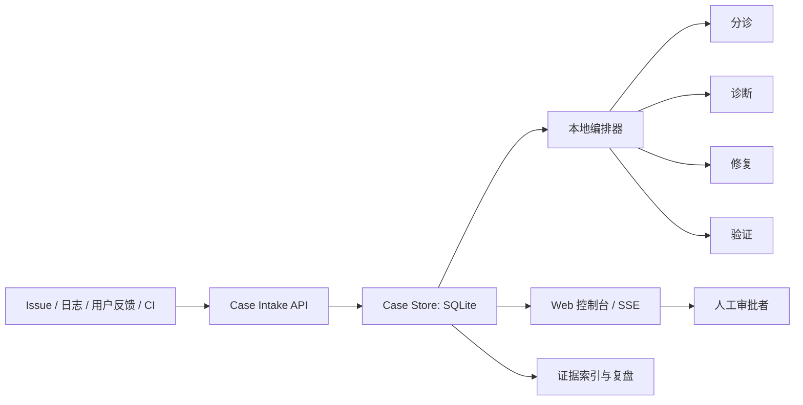

# Code CCTV DevLoop

定位你的 AI 编程：从“看见过程”到“受控闭环”。

**Code CCTV** 提供本地事件采集、中文工作日志和状态流；**DevLoop** 在此之上组织研发 Case、审批门禁、证据索引和多角色处置流程。项目面向 GOAI Agent Infra 方向三「软件研发全流程协同」。

项目框架与赛题映射见 [GOAI_Direction3_Project_Framework.md](GOAI_Direction3_Project_Framework.md)。

## 当前状态

- 管理界面已收敛为 `web/` 下的本地 Web 控制台，原 macOS SwiftUI、Windows PySide6 和旧静态看板已移除。
- 本地服务提供 Case API、SQLite 留存、SSE 更新、Web 控制台和本机服务发现。
- **企业级项目监控**：自动检索本机 git 仓库与运行中进程工作目录，选择要监控的项目，持续跟踪文件变化与 git 提交。
- **项目优先导航**：左侧边栏展示监控项目列表，视图（总览 / Case 审计 / 监控项目）按当前选中项目隔离。
- **自动化驱动**：对选中项目一键启动全量诊断（浏览文件树 / git / 测试探测 / 静态扫描），由 DeepSeek 生成中文总结，**即使无 Case 或错误也输出项目结论**，前端展示运行状态与计时。
- 默认运行的是进程内 Mock 工作流；`--runtime-mode agentscope` 是 AgentScope + DeepSeek 的本地实验路径，`production` 仅保留为其旧别名，不是 AgentTeams 的真实接入。
- **真实 AgentTeams 尚未配置、部署或验证。** 当前没有可作为 AgentTeams Team/Task/Handoff/Trace 的竞赛运行证据；本地生成的 UUID 和 AgentScope 事件不能这样表述。

## 快速开始

### 前置条件

- Python 3.10+
- 可选：`DEEPSEEK_API_KEY`，仅用于 AgentScope 的本地实验运行模式
- 人工审批时使用独立的 `CODE_CCTV_APPROVAL_KEY`

### 安装与验证

```bash
git clone https://github.com/cyc120/code-cctv-general.git
cd code-cctv-general
python3 -m pip install -r requirements.txt

# 回归测试与隔离演练仓库测试
python3 -m pytest tests/ demo_target/ -q

# 语法检查
python3 -m py_compile daemon/*.py agent_runtime/*.py agents/*.py
```

### 启动本地服务

```bash
# 使用自己持有的人工审批密钥；不要提交或写入 service.json
export CODE_CCTV_APPROVAL_KEY='replace-with-a-private-local-secret'
python3 -m daemon.serve
```

服务默认仅监听 `127.0.0.1`，并自动选择可用端口。端口、服务令牌和状态库路径写入当前平台的数据目录中的 `service.json`；可用下列命令查看该路径：

```bash
python3 -c "from daemon.paths import config_path; print(config_path())"
```

读取其中的 `port` 后，在同一台机器的浏览器中打开 `http://127.0.0.1:<port>/ui`。同源 Web 页面会读取服务令牌以连接本机服务；人工审批密钥不会出现在 `/ui/config`、`service.json` 或服务发现记录中。

### 本机服务发现

多个本机实例同时运行时，可启动本机服务发现入口：

```bash
python3 -m daemon.dashboard --open
```

发现器只读取并验证回环服务的地址、端口与健康状态，然后跳转至选中实例自己的 `/ui`。令牌和人工审批密钥均不写入发现描述符。

## Web 控制台

`web/index.html` 是唯一的管理界面来源，采用**项目优先导航**：左侧边栏固定展示品牌、监控项目列表（点击切换当前项目）和视图导航（总览 / Case 审计 / 监控项目），顶部栏显示当前项目与运行时状态。

- **项目选择窗口**：自动检索本机 git 仓库与运行中进程工作目录，勾选要监控的项目；支持手动添加路径。
- **总览视图**：当前项目的聚合统计（状态分布 / Agent 分工 / 活动趋势 / 工具 / 审批），加上 LLM 信息金字塔总结与「启动自动化驱动」按钮。
- **Case 审计**：Case 队列、详情与来源、Agent 运行、工具、审批、制品、知识与复盘证据页签。
- **监控项目**：已监控项目列表、运行状态与停止监控。
- SSE 自动刷新、主题切换、人工审批密钥输入。

首次运行无监控项目时，会自动弹出项目选择窗口引导。直接打开 HTML 文件需要手动填写本机 Host、Port 和服务令牌；通过服务端 `/ui` 打开时则使用同源连接配置。

## 核心闭环



| 角色 | 当前职责 | 明确边界 |
| --- | --- | --- |
| Triage Evidence | 聚合多源输入、去重、分类 | 不下根因结论、不改代码 |
| Diagnosis Impact | 形成根因与影响范围建议 | 不写工作树、不发布 |
| Repair | 在受控流程中生成补丁建议 | 不写主分支、不部署 |
| Verification Release | 执行质量门禁并形成建议 | 不忽略失败门禁、不批准发布 |

Case 状态机：

```text
RECEIVED -> TRIAGED -> DIAGNOSED -> PLAN_APPROVAL -> REPAIRING
    -> VERIFYING -> PATCH_REJECTED
    -> VERIFYING -> RELEASE_APPROVAL -> RELEASED -> CLOSED
                                        -> ROLLED_BACK -> CLOSED
```

`RELEASED` 在当前项目中表示本地模拟放行，不表示真实生产部署。

## 项目监控与自动化驱动

### 监控真实项目

对选中的本机项目，服务会持续跟踪文件变化（复用 `watch_worklog` 快照/差异引擎）与 git 提交增量，将事件写入本地 SQLite 并显示在总览的活动趋势中。监控是**只读**的，从不修改项目本身。

### 自动化驱动

总览视图的「启动自动化驱动」按钮对当前项目执行一次完整诊断（在后台线程进行，前端显示运行状态与计时）：

1. **浏览项目**：文件树、语言分布、规模、git 状态（remote / 分支 / HEAD / 未提交变更 / 近期提交）、关键文件与符号。
2. **测试探测**：安全检测并运行项目自身测试命令（pytest / npm test / make test / go test），带硬超时。
3. **静态扫描**：统计 TODO / FIXME 标记，定位错误处理缺口（Python `bare except`、JS 空 `catch`）。
4. **LLM 总结**：将浏览结果与确定性统计交给 DeepSeek，生成中文信息金字塔总结——**即使 0 个 Case、无测试失败也输出项目结论**。

结果以「项目浏览报告」（确定性 KPI）+「LLM 信息金字塔」双面板展示。驱动不改变项目文件。

### 项目 API

| 方法 | 路径 | 鉴权 | 用途 |
| --- | --- | --- | --- |
| `GET` | `/api/projects/discover` | `service_token` | 自动检索本机 git 仓库与运行进程工作目录 |
| `GET` | `/api/projects` | `service_token` | 已监控项目列表 |
| `POST` | `/api/projects` | `service_token` | 注册一个项目开始监控 |
| `DELETE` | `/api/projects/{workspace}` | `service_token` | 停止监控并移除 |
| `POST` | `/api/projects/{workspace}/drive` | `service_token` | 启动自动化驱动（202；已在运行则 409） |
| `GET` | `/api/projects/{workspace}/drive` | `service_token` | 最近一次驱动运行结果 |

## Case API 与审批

所有 API 均绑定在本机回环地址。普通接口使用 `X-Code-CCTV-Token`；审批签发另外要求 `X-Code-CCTV-Approval-Key`。

| 方法 | 路径 | 鉴权 | 用途 |
| --- | --- | --- | --- |
| `POST` | `/api/cases` | `service_token` | 创建或关联 Case，并交给编排器处理 |
| `GET` | `/api/cases` | `service_token` | 查询 Case 队列 |
| `GET` | `/api/cases/{id}` | `service_token` | 获取 Case 详情 |
| `GET` | `/api/cases/{id}/evidence` | `service_token` | 获取证据索引 |
| `POST` | `/api/cases/{id}/approval-grant` | `service_token` + 人工审批密钥 | 签发一次性审批 Grant |
| `POST` | `/api/cases/{id}/actions` | `approval_token`（批准/拒绝）或 `service_token`（取消） | 推进审批或取消 Case |
| `POST` | `/api/knowledge/{id}/review` | `service_token` + 人工审批密钥 | 复核知识条目 |

审批分为三个凭证层次：

| 凭证 | 持有者 | 能力 |
| --- | --- | --- |
| `service_token` | 服务页面、受限脚本、普通 API 调用方 | 事件上报、Case 查询/创建、取消；不能单独签发 Grant |
| `X-Code-CCTV-Approval-Key` | 人工审批者 | 与服务令牌共同签发 Grant，或复核知识条目；不经 `/ui/config` 下发 |
| `approval_token` | 一次审批流程 | 以 `X-Code-CCTV-Token-Type: approval` 消费对应的单次 Grant |

Web 审批流程为：人工输入审批密钥，服务端验证服务令牌和独立人工密钥后签发一次性 `approval_token`，页面立即用该 Grant 执行批准或拒绝动作。服务端只保存 Grant 的哈希，并校验状态、目标引用、有效期和单次使用。

这是一项防止持有 `service_token` 的 Agent 经 HTTP API 自行审批的边界，不是同一操作系统用户下对恶意本地进程的强隔离。

## AgentTeams 接入状态

赛题要求以真实 AgentTeams 协同为基点，但这一接入尚未完成。现有 `agent_runtime/teams_adapter.py` 是历史模块路径，公开实现已更名为 `AgentScopeExecutionAdapter`；它提供本地 Mock 和 AgentScope 驱动的实验路径，并不等同于 AgentTeams 控制面或 TeamHarness/Matrix 工作流。

在真实接入完成前：

- 不将 `agent_runtime/smoke_test.py` 的本地 UUID 当作 AgentTeams Team、Task 或 Trace 证据。
- 不将 AgentScope 的 Agent、模型调用事件或 `--runtime-mode agentscope`（以及旧别名 `production`）称为已部署 AgentTeams。
- 不将 `evidence/*.json` 作为已验证的赛事运行凭据提交；这些都是本地生成物，已被忽略规则排除。

`--runtime-mode agentteams` 会在前置检查未满足或 Workflow Bridge 未配置时失败关闭，不会回退伪装为 AgentScope。真实接入需要单独配置官方 AgentTeams 控制面、身份凭证、Team/Task/Handoff 工作流和可导出的 Trace，再用两条演练案例完成可复核验收。

可先执行只读的本机前置检查：

```bash
python3 -m daemon.serve --agentteams-preflight
```

该检查只观察 `agt`、Docker CLI 和本地 Docker socket；即使通过，也不表示已部署 AgentTeams、已有 TeamHarness 工作流或已产生官方 Trace。

## 目录结构

```text
code-cctv-general/
├── daemon/                  # HTTP、SSE、SQLite、项目监控与 Web 托管
│   ├── server.py            # Case / 项目 / 驱动路由、双因子审批与 SSE
│   ├── serve.py             # 本机服务入口
│   ├── dashboard.py         # 本机服务发现入口
│   ├── store.py             # Case、监控项目与驱动运行存储
│   ├── project_discovery.py # 本机 git 仓库 + 进程工作目录自动发现
│   ├── project_monitor.py   # 每项目监控线程（文件变化 + git 提交）
│   ├── drive.py             # 自动化驱动（浏览 + 测试 + 静态扫描）
│   ├── repo_identity.py     # 仓库身份规范化与 base_commit 解析
│   └── llm_summary.py       # DeepSeek LLM 总结与缓存（含驱动 prompt）
├── web/                     # 唯一 Web 管理界面（项目优先导航）
├── agent_runtime/           # 状态机、本地编排和 AgentScope 实验适配
├── agents/                  # 分诊、诊断、修复、验证角色
├── connectors/              # 外部输入规范化
├── tools/                   # 受控工具接口
├── retrospective/           # 异步复盘
├── demo_target/             # 隔离故障演练仓库
├── evidence/__init__.py     # 包标记；运行时导出不入库
├── tests/                   # 单元与 HTTP 集成测试
└── docs/                    # 赛题与设计材料
```

## 数据与提交边界

- 服务只监听 `127.0.0.1`。
- SQLite 保存结构化状态和证据索引；运行时 JSON 证据、工件与本地数据库不提交到仓库。
- `AI_WORKLOG.md`、`evidence/` 下的生成物和本机数据目录都由 `.gitignore` 排除。
- 审批 Grant 只保存哈希，不保存明文 `approval_token`。

## 许可证

Copyright 2026 Code CCTV DevLoop. All rights reserved.
