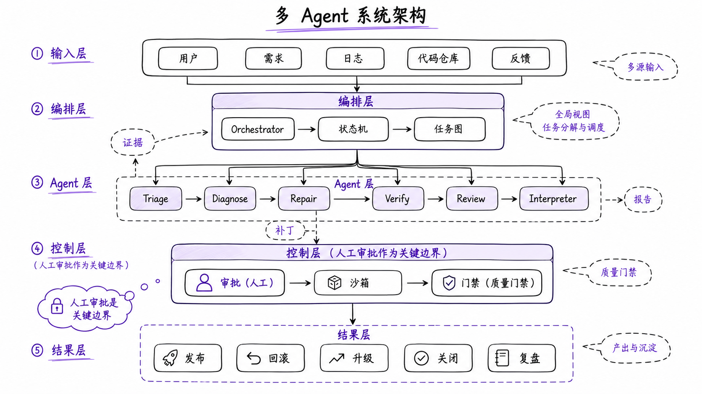
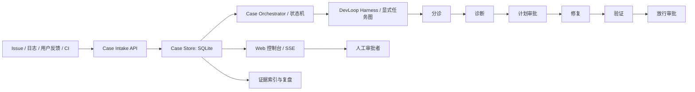

# Code Defog

定位你的 AI 编程：从「看见过程」到「受控闭环」。

**Code Defog** 是面向软件研发审查的本地多 Agent 工作台，将项目监控、结构化 Case、审批门禁、证据索引、代码地图与受限 LLM 解读串成一条可复核链路。

## 系统架构



## 一条命令启动

安装依赖后，直接运行：

```bash
python3 -m daemon.serve
```

服务只监听本机回环地址，会自动选择端口并打开已连接的控制台。无图形环境可追加 `--no-open`。

## 核心特点

- **受控闭环，而非黑箱生成。** 事件进入后走一条完整、可复核的状态机：`分诊 → 诊断 → 计划审批 → 修复 → 验证 → 放行审批 → 发布/回滚 → 复盘`。每一步都是显式状态转移，不把「模型输出」当作「执行结果」。
- **确定性优先，模型叙述只作参考。** 图表与计数均来自 SQLite 的确定性聚合；LLM 仅生成项目总结和受证据约束的代码解读。未启用可用模型时，系统会明确显示「不可用」，绝不伪造结果。
- **Agent 不能自己批准自己。** 审批采用三层凭证隔离：`service_token`（服务页面/脚本）、人工审批密钥（`X-Code-Defog-Approval-Key`）、一次性 `approval_token`。持有服务令牌的 Agent 无法经 HTTP 签发或消费审批，修复与放行必须过人工门禁。
- **全程可审计的证据链。** 工具调用按 Case 形成哈希链（`chain_hash`），制品写入与读取都做 SHA-256 校验并防路径逃逸，审批 Grant 只存哈希、审批/工具/制品/知识/复盘全部落库可追溯。
- **项目优先的一体化控制台。** 自动发现本机 git 仓库与运行中进程的工作目录，只读监控文件变化与提交增量；全项目 Review Run 把「结构审查 + 测试探测 + 静态扫描 + 总结 + Case 判定」聚合成可刷新、可经 SSE 观察的任务图。
- **诚实的接入边界。** 明确区分本地 Mock / AgentScope 实验路径与真实 AgentTeams 接入，不将本地生成物误作真实运行凭据（详见「AgentTeams 接入边界」）。

## 快速开始

### 前置条件

- Python 3.10+
- 可选：`DEEPSEEK_API_KEY`，作为 DeepSeek 的首次运行兼容回退；也可在 Web 控制台的「LLM 设置」中切换厂商、模型与密钥。本机 Ollama 可免密使用；未启用可用模型时，确定性统计与审计功能仍可正常运行。
- 人工审批使用独立的 `CODE_DEFOG_APPROVAL_KEY`。

### 安装与验证

```bash
git clone https://github.com/cyc120/code-defog.git
cd code-defog
python3 -m pip install -r requirements.txt

# 回归测试与隔离演练仓库测试
python3 -m pytest tests/ demo_target/ -q

# 语法检查
python3 -m py_compile daemon/*.py agent_runtime/*.py agents/*.py
```

### 启动本地服务

```bash
# 使用自己持有的人工审批密钥；不要提交或写入 service.json
export CODE_DEFOG_APPROVAL_KEY='replace-with-a-private-local-secret'
python3 -m daemon.serve
```

服务默认仅监听 `127.0.0.1`，自动选择可用端口，并在启动完成后自动打开已连接的本机控制台；无需填写端口或服务令牌。若在 CI 或无图形环境运行，使用 `--no-open`：

```bash
python3 -m daemon.serve --no-open
```

在 macOS 上，也可以直接双击 [`scripts/open-code-defog.command`](scripts/open-code-defog.command)。它会在项目目录启动同一条服务命令，并由服务自动打开已连接的控制台。

端口、服务令牌和状态库路径仍写入当前平台数据目录的 `service.json`：

```bash
python3 -c "from daemon.paths import config_path; print(config_path())"
```

控制台由服务自身的同源页面读取服务令牌并连接；人工审批密钥不会出现在 `/ui/config`、`service.json` 或服务发现记录中。选中一个已监控项目后，可从顶栏的项目助手入口询问进度、风险与下一步。

### 本机服务发现

多个本机实例同时运行时，可启动服务发现入口：

```bash
python3 -m daemon.dashboard --open
```

发现器只读取并验证回环服务的地址、端口与健康状态；唯一健康实例会自动跳转至自己的 `/ui`，多个实例才要求选择。令牌与人工审批密钥均不写入发现描述符。

## 核心闭环



| 角色 | 当前职责 | 明确边界 |
| --- | --- | --- |
| Triage Evidence | 聚合多源输入、去重、分类 | 不下根因结论、不改代码 |
| Diagnosis Impact | 形成根因与影响范围建议 | 不写工作树、不发布 |
| Repair | 在受控流程中生成补丁建议 | 不写主分支、不部署 |
| Verification Release | 执行质量门禁并形成建议 | 不忽略失败门禁、不批准发布 |
| Project Review | 归纳已收集的项目结构元数据 | 只读；不创建审批、不推进 Case、不执行修复 |
| Code Interpreter | 解读用户选中的代码图节点或选区 | 只读；仅接收受限 Node/Selection Dossier，不执行命令、不读任意路径、不改代码 |

Case 状态机：

```text
RECEIVED -> TRIAGED -> DIAGNOSED -> PLAN_APPROVAL -> REPAIRING
    -> VERIFYING -> PATCH_REJECTED
    -> VERIFYING -> RELEASE_APPROVAL -> RELEASED -> CLOSED
                                        -> ROLLED_BACK -> CLOSED
```

`RELEASED` 在当前项目中表示本地模拟放行，不表示真实生产部署。

## Web 控制台

`web/index.html` 是唯一的管理界面来源，采用**项目优先导航**：左侧边栏固定展示品牌、监控项目列表（点击切换当前项目）和视图导航（项目审查 / 代码地图 / Case 审计 / 监控项目），顶部栏显示当前项目与运行时状态。

- **项目选择窗口**：自动检索本机 git 仓库与运行中进程工作目录，勾选要监控的项目；支持手动添加路径。
- **项目审查视图**：首屏为自助化驱动。范围使用完整/快速分段控件，检查项可分别启用测试、静态风险和 Git；随后显示 Harness 运行模式、阶段任务图、确定性发现、关联 Case 和审查历史。聚合统计与 LLM 信息金字塔下移到结果之后。
- **代码地图**：只解析当前已登记的被监控项目，不默认解析 Code Defog 自身。全宽画布以目录、文件、符号和导入关系绘制 2D 地图；关系标记为 `static`、`unresolved` 等证据等级。画布支持滚轮缩放、空白区域拖拽平移和大小复位。点击文件或符号后，画布内可拖动的悬浮机器人会自动调用当前已启用的 LLM，给出节点职责与一跳关系流的简要说明；请求固定只发送结构元数据和一跳关系，不发送源码。模型结论始终标为“非执行证据”，且只能引用当前 dossier 的节点或边证据。
- **Case 审计**：Case 队列、详情与来源、Agent 运行、工具、审批、制品、知识与复盘证据页签。
- **Harness 调度**：从只读 `/api/harness` 清单展示当前任务图、各 Agent 边界和实际运行记录；审批状态不会被派发给 Agent。
- **项目助手**：顶栏打开当前项目的只读问答抽屉，可询问进度、风险和下一步；每次请求仅携带最近 6 条浏览器内存对话，不落库，切换项目或刷新页面即清空。重复请求在同一项目状态下短时复用结果，生成中可随时停止。
- **LLM 设置**：顶栏设置入口可切换 DeepSeek、OpenAI、Ollama（本机）或自定义 OpenAI 兼容服务，修改兼容地址、模型并保存密钥；可单独测试已保存配置。项目总结、项目助手和 Review Run 共用当前选中的厂商与模型。
- **监控项目**：已监控项目列表、运行状态与停止监控。
- SSE 自动刷新、主题切换、人工审批密钥输入。

首次运行无监控项目时，会自动弹出项目选择窗口引导。正式入口是服务启动后自动打开的 `/ui`，它使用同源连接配置，不要求填写 Host、Port 或服务令牌。直接打开 `web/index.html` 仅用于开发预览：它会安全复用最近验证过的本机服务；若没有可复用服务，会显示一键复制的启动命令，而不是默认展开连接配置。浏览器本身不能安全读取本机令牌或启动 Python 服务，因此冷启动仍需运行上述命令（或双击 macOS 启动器）。

### LLM 厂商与密钥

首选在控制台顶栏的「LLM 设置」保存并启用一个厂商。当前实现使用 OpenAI 兼容的 `/chat/completions` 协议，内置 DeepSeek、OpenAI、Ollama 和自定义兼容端点预设。DeepSeek、OpenAI 与远程自定义端点需要 API 密钥；本机 Ollama 可免密直接调用。自定义远程端点必须使用 HTTPS；`http://` 仅允许本机 `localhost`/回环地址，以支持 Ollama。

密钥保存在当前用户应用数据目录的 `llm_providers.json`，目录权限 `0700`、文件权限 `0600`。它不进入 git 工作区、SQLite、SSE、工作日志、浏览器 `localStorage` 或任何 API 响应。页面只显示是否已配置和来源类型，不显示密钥或其片段。保存的 DeepSeek 密钥优先于环境变量；尚未保存时，才兼容读取 `DEEPSEEK_API_KEY`。

代码地图仅返回相对路径、符号、行号、关系证据与内容指纹，不返回源码或绝对工作区路径。点击文件或符号后，悬浮机器人会自动向当前 LLM 厂商发送受限的节点元数据与一跳关系，并在画布内展示职责摘要；页面不会发送源码。

连接测试会向选中模型发起一次有界请求，以验证端点、密钥、模型和 TLS 信任链，不会关闭 HTTPS 校验。为防密钥外泄，连接测试在复用已保存/环境密钥时，只允许指向该厂商的官方端点或已保存的自定义端点；对陌生端点必须显式提供一次性密钥。存在企业 HTTPS 代理时，应将组织根证书加入服务 Python 的可信 CA bundle。

## 项目监控与自动化驱动

### 监控真实项目

对选中的本机项目，服务持续跟踪文件变化（复用 `watch_worklog` 快照/差异引擎）与 git 提交增量，将事件写入本地 SQLite 并显示在总览的活动趋势中。监控是**只读**的，从不修改项目本身。

### 全项目 Review Run

项目审查视图的「开始全项目审查」会创建独立的 `Review Run`（后台线程），而不是伪造一个 Case。运行持久化下列任务并通过 SSE 推送状态：

1. **准备上下文与项目结构审查**：收集文件树、语言分布、规模、关键符号，以及按范围选择的 Git 元数据；Project Review Agent 只归纳这些已收集的只读信息。
2. **测试探测与静态扫描**：两个确定性任务并行执行。Python 的 `tests/` 目录会根据测试源码选择 `unittest discover` 或 pytest；调用使用守护进程自身的解释器并带硬超时。快速模式把测试超时限制为 20 秒，并缩小静态扫描文件/行数预算。
3. **总结与 Case 处理**：将确定性结果交给可选 LLM 总结；只有已实际执行的测试超时或非零退出才创建/合并 Case，然后进入既有 Triage -> Diagnosis 流程。

单个审查任务可以是 `error`，但 Review Run 仍会完成其余独立任务、总结和 Case 判定；页面不会把部分失败显示为全绿。项目审查、测试和静态扫描均不改变项目文件。

自动升级 Case 的触发条件严格限定为：已检测并实际执行的测试**超时**，或测试进程以**非零退出码**结束。静态扫描的 TODO/FIXME、错误处理提示、文件变更、git 提交、未检测到测试，以及测试命令无法启动，都只保留为观测信息，避免以噪声自动创建 Case。升级后由既有 `Orchestrator -> DevLoopHarness -> Triage` 链路处理；同一开放事故按现有指纹归并。

### 项目 API

| 方法 | 路径 | 鉴权 | 用途 |
| --- | --- | --- | --- |
| `GET` | `/api/projects/discover` | `service_token` | 自动检索本机 git 仓库与运行进程工作目录 |
| `GET` | `/api/projects` | `service_token` | 已监控项目列表 |
| `GET` | `/api/harness` | `service_token` | 本地 Harness 任务图与 Agent 边界（只读） |
| `POST` | `/api/projects` | `service_token` | 注册一个项目开始监控 |
| `DELETE` | `/api/projects/{workspace}` | `service_token` | 停止监控并移除 |
| `POST` | `/api/projects/{workspace}/drive` | `service_token` | 启动全项目 Review Run（202；已在运行则 409；路径名为兼容保留） |
| `GET` | `/api/projects/{workspace}/drive` | `service_token` | 最近一次 Review Run（兼容路径） |
| `GET` | `/api/projects/{workspace}/reviews` | `service_token` | 最近的 Review Run 及任务历史 |
| `POST` | `/api/projects/{workspace}/assistant` | `service_token` | 基于该已监控项目的聚合统计、最新浏览报告和有界浏览器内存上下文进行只读问答 |
| `GET` | `/api/projects/{workspace}/code-graph` | `service_token` | 当前已登记项目的有界、脱敏代码关系图（无源码、无绝对路径） |
| `POST` | `/api/projects/{workspace}/code-graph/interpret` | `service_token` | 构建受限节点 dossier，并调度只读 Code Interpreter Agent |
| `GET` | `/api/llm/providers` | `service_token` | 厂商、端点、模型和密钥配置状态（不含密钥） |
| `POST` | `/api/llm/providers` | `service_token` | 保存并启用厂商、模型、端点和可选密钥；切换后清空叙述缓存 |
| `POST` | `/api/llm/providers/test` | `service_token` | 对当前保存配置或一次性输入密钥执行连接测试；不保存一次性密钥 |

项目助手不具备审批、调度、命令执行、代码修改或发布权限。它只接收经过裁剪的项目监控记录、Case 聚合统计、最新项目浏览报告和最近 6 条经服务端裁剪的浏览器内存消息；不会发送 git remote、令牌、源码、完整测试输出或完整聊天记录。未配置当前厂商密钥时，接口会明确返回不可用状态，不会伪造回答。

## Case API 与审批

所有 API 均绑定在本机回环地址。普通接口使用 `X-Code-Defog-Token`；审批签发另外要求 `X-Code-Defog-Approval-Key`。为便于已有本机脚本平滑升级，服务端仍接受旧 `X-Code-CCTV-*` 请求头，但新集成应只使用 `X-Code-Defog-*`。

| 方法 | 路径 | 鉴权 | 用途 |
| --- | --- | --- | --- |
| `POST` | `/api/cases` | `service_token` | 创建或关联 Case，并交给编排器处理 |
| `GET` | `/api/cases` | `service_token` | 查询 Case 队列 |
| `GET` | `/api/cases/{id}` | `service_token` | 获取 Case 详情 |
| `GET` | `/api/cases/{id}/evidence` | `service_token` | 获取证据索引 |
| `POST` | `/api/cases/{id}/approval-grant` | `service_token` + 人工审批密钥 | 签发一次性审批 Grant |
| `POST` | `/api/cases/{id}/actions` | `approval_token`（批准/拒绝）或 `service_token`（取消） | 推进审批或取消 Case |
| `POST` | `/api/knowledge/{id}/review` | `service_token` + 人工审批密钥 | 复核知识条目 |

审批分为三个凭证层次：

| 凭证 | 持有者 | 能力 |
| --- | --- | --- |
| `service_token` | 服务页面、受限脚本、普通 API 调用方 | 事件上报、Case 查询/创建、取消；不能单独签发 Grant |
| `X-Code-Defog-Approval-Key` | 人工审批者 | 与服务令牌共同签发 Grant，或复核知识条目；不经 `/ui/config` 下发 |
| `approval_token` | 一次审批流程 | 以 `X-Code-Defog-Token-Type: approval` 消费对应的单次 Grant |

Web 审批流程为：人工输入审批密钥，服务端验证服务令牌和独立人工密钥后签发一次性 `approval_token`，页面立即用该 Grant 执行批准或拒绝动作。服务端只保存 Grant 的哈希，并校验状态、目标引用、有效期和单次使用。

这是一项防止持有 `service_token` 的 Agent 经 HTTP API 自行审批的边界，不是同一操作系统用户下对恶意本地进程的强隔离。

## AgentTeams 接入边界

真实 AgentTeams 接入尚未完成。当前 `agent_runtime/harness.py` 的 `DevLoopHarness` 已统一本地任务图与所有业务 Agent 派发，`agent_runtime/teams_adapter.py` 的公开实现为 `AgentScopeExecutionAdapter`；两者组成的是本地 Mock/AgentScope 实验路径，并不等同于外部 AgentTeams 控制面、TeamHarness 或 Matrix 工作流。

在真实接入完成前：

- 不将 AgentScope 的 Agent、模型调用事件或 `--runtime-mode agentscope`（以及旧别名 `production`）称为已部署 AgentTeams。
- 不将 `evidence/*.json` 作为已验证的真实 AgentTeams 运行凭据；这些都是本地生成物，已被忽略规则排除。

`--runtime-mode agentteams` 会在前置检查未满足或 Workflow Bridge 未配置时失败关闭，不会回退伪装为 AgentScope。真实接入需要单独配置官方 AgentTeams 控制面、身份凭证、Team/Task/Handoff 工作流和可导出的 Trace，再用两条演练案例完成可复核验收。

可先执行只读的本机前置检查：

```bash
python3 -m daemon.serve --agentteams-preflight
```

该检查只观察 `agt`、Docker CLI 和本地 Docker socket；即使通过，也不表示已部署 AgentTeams、已有 TeamHarness 工作流或已产生官方 Trace。

## 目录结构

```text
code-defog/
├── daemon/                  # HTTP、SSE、SQLite、项目监控与 Web 托管
│   ├── server.py            # Case / 项目 / 驱动路由、双因子审批与 SSE
│   ├── serve.py             # 本机服务入口
│   ├── dashboard.py         # 本机服务发现入口
│   ├── store.py             # Case、监控项目、Review Run 与任务存储
│   ├── project_discovery.py # 本机 git 仓库 + 进程工作目录自动发现
│   ├── project_monitor.py   # 每项目监控线程（文件变化 + git 提交）
│   ├── drive.py             # Review Run（浏览 + Agent + 测试 + 静态扫描）
│   ├── repo_identity.py     # 仓库身份规范化与 base_commit 解析
│   ├── llm_providers.py     # 本地厂商、模型与受限密钥配置
│   ├── llm_summary.py       # 多厂商项目总结、驱动与只读助手 prompt
│   ├── code_graph.py        # 被监控项目的有界文件/符号/导入关系图
│   └── code_semantics.py     # Node/Selection Dossier 与受证据约束的 LLM 解读
├── web/                     # 唯一 Web 管理界面（项目优先导航）
├── agent_runtime/           # 状态机、Case/Review Context、Harness 和 AgentScope 实验适配
├── agents/                  # 分诊、诊断、修复、验证、项目审查与代码解读角色
├── connectors/              # 外部输入规范化（占位）
├── tools/                   # 受控工具接口
├── policy/                  # 工具执行策略（占位）
├── retrospective/           # 异步复盘
├── demo_target/             # 隔离故障演练仓库
├── tests/                   # 单元与 HTTP 集成测试
└── docs/                    # 架构图与项目展示资源
    ├── images/              # README 使用的架构图
    └── screenshots/         # 项目展示图
```

## 数据与提交边界

- 服务只监听 `127.0.0.1`。
- SQLite 保存结构化状态和证据索引；运行时 JSON 证据、工件与本地数据库不提交到仓库。
- `AI_WORKLOG.md`、运行时 `evidence/` 导出和本机数据目录都由 `.gitignore` 排除。
- 审批 Grant 只保存哈希，不保存明文 `approval_token`。
- LLM 密钥单独保存在受限权限的 `llm_providers.json`，不进入 SQLite、SSE、日志或任何 API 响应。

## 许可证

Copyright 2026 Code Defog. All rights reserved.
