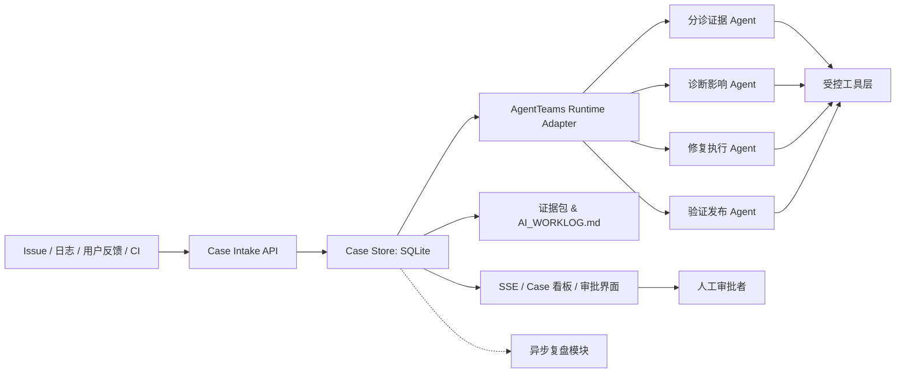

# Code CCTV DevLoop

定位你的 AI 编程 — 从"看见过程"到"受控闭环"。

**Code CCTV** 是一套通用 AI 编程监控与中文工作日志工具；**DevLoop** 是在此之上构建的多 Agent 软件研发闭环系统（GOAI Agent Infra 赛道 · 方向三参赛项目）。

---

## 项目定位

```
Code CCTV（已有）                DevLoop（新增）
┌─────────────────────┐       ┌──────────────────────────────┐
│ AI_WORKLOG.md       │       │ Case 管理 & 多源归并          │
│ 本地 HTTP/SSE 服务   │  →   │ AgentTeams 多 Agent 编排      │
│ SQLite 状态留存      │       │ 审批门禁 & 安全审计           │
│ 跨平台原生界面       │       │ 受控工具链 & 证据哈希链       │
│                     │       │ 质量门禁 & 复盘知识沉淀        │
└─────────────────────┘       └──────────────────────────────┘
```

> 将一次软件缺陷处置变成可追踪、可验证、可回滚、可复用的工程闭环。

**赛道信息：** [GOAI 世界人工智能开源大赛](https://www.goaihz.com) — Agent Infra（新智基座）赛道 — 方向三「软件研发全流程协同」

**项目框架文档：** [GOAI_Direction3_Project_Framework.md](GOAI_Direction3_Project_Framework.md)

---

## 快速开始

### 前置条件

- Python 3.10+
- DeepSeek API Key（设为环境变量 `DEEPSEEK_API_KEY`；用于 AgentTeams 生产模式）

### 安装

```bash
git clone https://github.com/cyc120/code-cctv-general.git
cd code-cctv-general
pip install agentscope pytest
```

### 运行冒烟测试

```bash
# AgentTeams Runtime 冒烟验证 — 创建 Team、提交 Task、获取真实 ID
python agent_runtime/smoke_test.py

# 输出：
#   team_id:  team-xxxxxxxxxxxx
#   task_id:  task-xxxxxxxxxxxx
#   trace_id: trace-xxxxxxxxxxxxxxxx
#   Evidence saved to: evidence/
```

### 运行所有测试

```bash
python -m pytest tests/ demo_target/ -q
# 66 passed
```

### 启动本地服务

```bash
python -m daemon.serve
# 服务监听 127.0.0.1，支持 Case API + 原有 CCTV API
```

---

## 架构概览



### 4 个核心 Agent

| Agent | 职责 | 执行动作 | 明确禁止 |
|-------|------|---------|---------|
| Triage Evidence | 聚合多源输入、去重、分类 | 写入 Case、标注优先级 | 不下根因结论、不改代码 |
| Diagnosis Impact | 检索代码、建立根因假设 | 生成诊断报告、评估风险 | 不写工作树、不发布 |
| Repair | 隔离工作树生成补丁 | 创建分支/补丁、运行单测 | 不写主分支、不部署 |
| Verification Release | 质量门禁、模拟灰度 | 执行测试、生成验证报告 | 不忽略失败门禁 |

### Case 状态机

```
RECEIVED → TRIAGED → DIAGNOSED → PLAN_APPROVAL → REPAIRING
    → VERIFYING → PATCH_REJECTED (gate fail)
    → VERIFYING → RELEASE_APPROVAL → RELEASED → CLOSED
                                        ↘ ROLLED_BACK → CLOSED
```

---

## Case API（DevLoop 新增）

所有接口绑定 `127.0.0.1`，沿用 `X-Code-CCTV-Token` 鉴权。

| 方法 | 路径 | 鉴权 | 用途 |
|------|------|------|------|
| `POST` | `/api/cases` | `service_token` | 创建或关联 Case（自动归并/去重） |
| `GET` | `/api/cases` | `service_token` | 按状态/仓库查询 Case 队列 |
| `GET` | `/api/cases/{id}` | `service_token` | 获取 Case 详情 |
| `POST` | `/api/cases/{id}/actions` | `approval_token`（审批类）/ `service_token`（cancel） | 审批通过/拒绝/取消 |
| `GET` | `/api/cases/{id}/evidence` | `service_token` | 导出完整证据索引（含哈希链） |

### 令牌分离

| 令牌类型 | 持有者 | 可访问 |
|---------|--------|--------|
| `service_token` | Agent、脚本 | 事件上报、Case 查询、状态流 |
| `approval_token` | 人工审批者 | 一次性审批 Grant（签发与消费分离） |

Agent 持有的 `service_token` 不能执行审批动作 — 调用审批类端点返回 `403 Forbidden`。

### 两级指纹

```
delivery_id = SHA256(source_type | source_uri | client_nonce)  # 传输幂等
incident_signature = SHA256(repo | exception_type | message_pattern | key_frames)  # 跨源关联
```

---

## AgentTeams 集成

### 模式

| 模式 | 命令 | 用途 |
|------|------|------|
| Mock | `adapter.set_mode("mock")` | 进程内 stub 调用 — 单元测试 / 离线开发 |
| Production | `adapter.set_mode("production")` | 真实 AgentScope Agent + DeepSeek LLM |

### 生产冒烟验证

```python
from agent_runtime.teams_adapter import AgentTeamsAdapter
adapter = AgentTeamsAdapter(store)
adapter.set_mode("production")
# 创建 4 个 AgentScope Agent，dispatch_task() 调用真实 LLM
agent_result = adapter.dispatch_task(case_id, "TRIAGED", ctx)
# 返回: {agent, case_id, task_id, trace_id, team_id, result_summary}
```

生产模式依赖 `DEEPSEEK_API_KEY` 环境变量。

---

## 目录结构

```
code-cctv-general/
├── daemon/                  # HTTP、SSE、SQLite — Case API + 原有 CCTV API
│   ├── server.py            # 令牌分离、Case 路由、SSE 推送
│   └── store.py             # 10 个 DevLoop 表 + 原有监控表 + 迁移
├── agent_runtime/           # AgentTeams 编排层
│   ├── teams_adapter.py     # Mock / Production 双模式
│   ├── orchestrator.py      # Case 生命周期协调
│   ├── state_machine.py     # 12 状态转移表
│   ├── case_context.py      # 结构化交接契约
│   ├── identities.yaml      # 4 个 Agent 身份定义
│   └── smoke_test.py        # AgentTeams 冒烟验证脚本
├── agents/                  # 4 个核心 Agent（P1 stub → P2 模型驱动）
│   ├── triage.py
│   ├── diagnosis.py
│   ├── repair.py
│   └── verification.py      # 真实 quality_gate.py 调用
├── retrospective/           # 异步复盘批处理
├── connectors/              # 外部输入规范化接入
├── tools/                   # 受控 Git/检索/测试/部署模拟
├── policy/                  # 审批策略、风险分级
├── evidence/                # 烟雾测试与生产调度证据
├── demo_target/             # 隔离故障演练仓库
│   ├── cli.py               # 故意有 bug 的 CLI（Case A & Case B）
│   ├── quality_gate.py      # 质量门禁脚本（驱动 PATCH_REJECTED）
│   └── test_config.py       # 7 个隔离场景测试
├── scripts/                 # 现有 CCTV 脚本
│   ├── update_worklog.py
│   ├── watch_worklog.py
│   └── event_client.py
├── skills/code-cctv/        # CCTV Skill 定义
├── macos/                   # SwiftUI 原生界面
├── windows/                 # PySide6 原生界面
├── tests/                   # 56 单元 + HTTP 集成测试
└── docs/                    # 独立材料目录
```

---

## 开发与验证

```bash
# 语法检查
python -m py_compile daemon/*.py agent_runtime/*.py agents/*.py

# 全量测试（56 单元 + 7 demo + HTTP 集成）
python -m pytest tests/ demo_target/ -q

# AgentTeams 冒烟验证
python agent_runtime/smoke_test.py
```

提交前不要包含：
- `AI_WORKLOG.md`
- `evidence/` 下的运行时证据（冒烟测试产出的 `smoke_test_*.json` 除外）
- 数据目录（`%APPDATA%\CodeCCTV\` 或 `~/Library/Application Support/CodeCCTV/`）

---

## 平台支持

| 功能 | macOS | Windows |
|------|-------|---------|
| 中文工作日志 `AI_WORKLOG.md` | ✅ | ✅ |
| 文件变化监听 | ✅ | ✅ |
| 本地 HTTP/SSE 服务 | ✅ | ✅ |
| Case API & Agent 编排 | ✅ | ✅ |
| AgentTeams 生产模式 | ✅ | ✅ |
| 原生界面 | ✅ SwiftUI | ✅ PySide6 |

---

## 隐私边界

- 所有服务监听 `127.0.0.1`，不对外开放
- SQLite 保存结构化摘要，不存储原始聊天全文
- 审批令牌仅存哈希（`SHA256(approval_token)`），不存明文
- 证据哈希链（`chain_hash`）面向重放验证，不可篡改
- Agent 持有的 `service_token` 不能执行审批动作

---

## 许可证

© 2026 Code CCTV DevLoop. All rights reserved.
